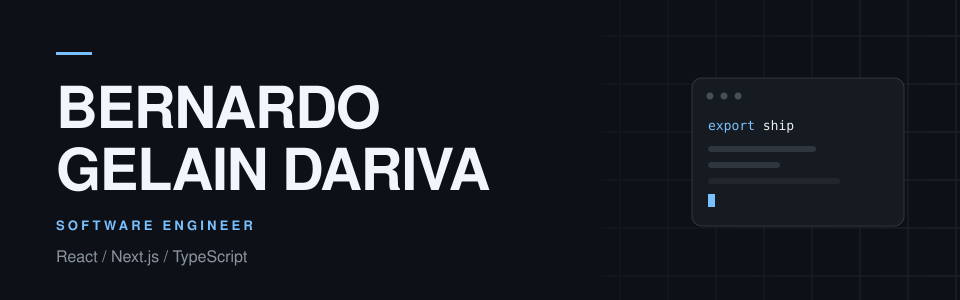

<picture>
  <source media="(prefers-color-scheme: dark)" srcset="assets/profile-hero-dark.svg" />
  <source media="(prefers-color-scheme: light)" srcset="assets/profile-hero-light.svg" />
  
</picture>

 
 

  <a href="https://linkedin.com/in/bernardogelaindariva">LinkedIn</a>
  &nbsp;&nbsp;·&nbsp;&nbsp;
  <a href="mailto:bernardogdariva@gmail.com">Email</a>
  &nbsp;&nbsp;·&nbsp;&nbsp;
  Passo Fundo, Brazil

 
 

  

 
 

<picture>
  <source media="(prefers-color-scheme: dark)" srcset="https://raw.githubusercontent.com/BernardoGelain/BernardoGelain/output/github-contribution-grid-snake-dark.svg" />
  <source media="(prefers-color-scheme: light)" srcset="https://raw.githubusercontent.com/BernardoGelain/BernardoGelain/output/github-contribution-grid-snake.svg" />
  
</picture>

 
 
 

EXPERIENCE

 
 

**WEG** &nbsp;&nbsp;2024 — Present 
Frontend Engineer 
Enterprise B2B product configurator 
React · Next.js · TypeScript

 
 

**Softo** &nbsp;&nbsp;2023 — 2024 
Frontend Developer 
Client products including iFood Carreiras, BlogTech, and Lush 
Next.js · React · TypeScript · SSR · SEO

 
 

**Cresce Vendas** &nbsp;·&nbsp; React Developer &nbsp;2021 — 2023 
Whitelabel e-commerce and CRM. SSG to SSR migration. 
Next.js · TypeScript · GraphQL

 

**Verum Digital** &nbsp;·&nbsp; React Developer &nbsp;2019 — 2021 
Product interfaces backed by Laravel APIs and PostgreSQL 
React · Laravel · PostgreSQL

 
 
 

SELECTED PUBLIC WORK

 
 

**[FoodShop](https://github.com/BernardoGelain/foodShop)** &nbsp;·&nbsp; [Repository ↗](https://github.com/BernardoGelain/foodShop) 
Whitelabel restaurant storefront 
React · TypeScript · Vite

 
 

**[Marcante](https://admin-panels-chi.vercel.app)** &nbsp;·&nbsp; [Live](https://admin-panels-chi.vercel.app) · [Frontend](https://github.com/BernardoGelain/admin-panels) · [API](https://github.com/BernardoGelain/admin-panels-backend) 
Geolocated panel management platform 
Next.js · NestJS · PostgreSQL

 
 

[Angling ↗](https://github.com/BernardoGelain/angling-app)
&nbsp;&nbsp;·&nbsp;&nbsp;
[CryptoTracker ↗](https://github.com/BernardoGelain/crypto-tracker)
&nbsp;&nbsp;·&nbsp;&nbsp;
[Live ↗](https://gelain-crypto-tracker.vercel.app)

