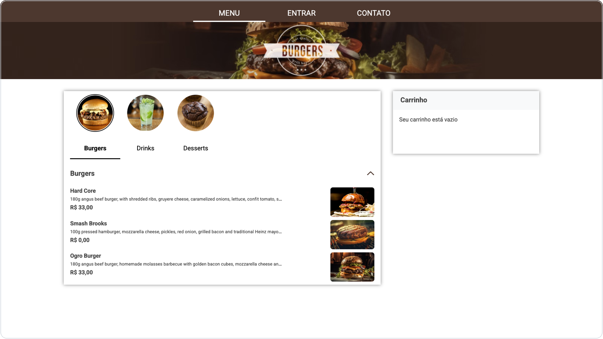
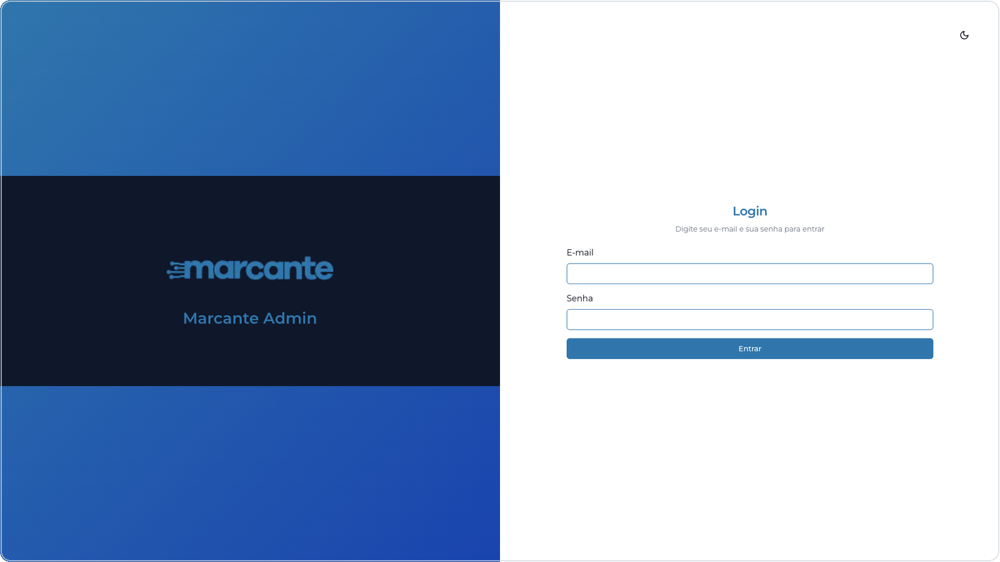
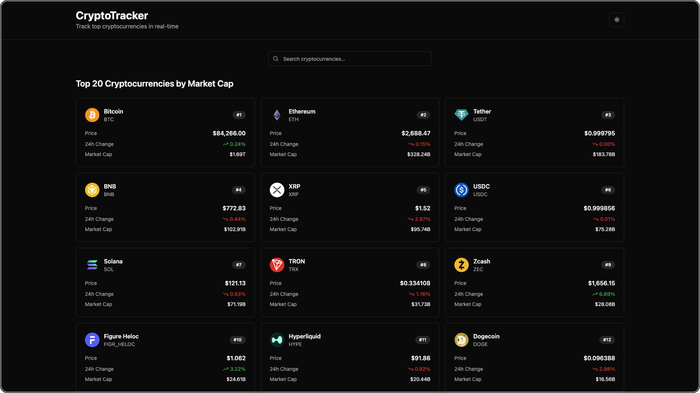

<picture>
  <source media="(prefers-color-scheme: dark)" srcset="assets/profile-hero-dark.svg" />
  <source media="(prefers-color-scheme: light)" srcset="assets/profile-hero-light.svg" />
  
</picture>

 
 

  <a href="https://linkedin.com/in/bernardogelaindariva">LinkedIn</a>
  &nbsp;&nbsp;·&nbsp;&nbsp;
  <a href="mailto:bernardogdariva@gmail.com">Email</a>
  &nbsp;&nbsp;·&nbsp;&nbsp;
  Passo Fundo, Brazil

 
 

  

 
 
 

SELECTED WORK

 

**[FoodShop](https://github.com/BernardoGelain/foodShop)** &nbsp;&nbsp;·&nbsp;&nbsp; [Repository ↗](https://github.com/BernardoGelain/foodShop)

Whitelabel restaurant storefront

React · TypeScript · Vite

 
 
 

**[Marcante](https://admin-panels-chi.vercel.app)** &nbsp;&nbsp;·&nbsp;&nbsp; [Live](https://admin-panels-chi.vercel.app) · [Frontend](https://github.com/BernardoGelain/admin-panels) · [API](https://github.com/BernardoGelain/admin-panels-backend)

Geolocated panel management platform

Next.js · NestJS · PostgreSQL

 
 
 

**[CryptoTracker](https://gelain-crypto-tracker.vercel.app)** &nbsp;&nbsp;·&nbsp;&nbsp; [Live](https://gelain-crypto-tracker.vercel.app) · [Code](https://github.com/BernardoGelain/crypto-tracker)

 
 

  <a href="https://github.com/BernardoGelain/angling-app">Angling ↗</a>

 
 
 

<picture>
  <source media="(prefers-color-scheme: dark)" srcset="https://raw.githubusercontent.com/BernardoGelain/BernardoGelain/output/github-contribution-grid-snake-dark.svg" />
  <source media="(prefers-color-scheme: light)" srcset="https://raw.githubusercontent.com/BernardoGelain/BernardoGelain/output/github-contribution-grid-snake.svg" />
  
</picture>

